# Delta Force Extraction Map Design Study: Zero Dam, Longbow Valley, Space Base
> Language / 语言：[中文](README.md) | English
>
> One-line pitch: extract reusable extraction-shooter map lessons from Delta Force's Zero Dam, Longbow Valley, and Space Base.
>
> For: FPS level designers, PvPvE / extraction-shooter teams, systems designers, map designers, and game-analysis writers.
>
> Reading value: this is not a loot-route guide; it is a transferable map-structure breakdown for resource gravity, entrances, extraction pressure, PvE friction, and weapon workspaces.
>
> Author: 魔魔王; version: v1.0; publication date: 2026-06-13.
>
> Reading entry: this page is the complete English edition; use [INDEX.en.md](INDEX.en.md) for the compact index.

## Key Takeaways

- An extraction map is first an in-match economic machine: resource pull, route risk, encounter uncertainty, and extraction payout have to be designed together.
- Zero Dam is useful because of its door lines, indoor/outdoor switches, and central pull; it shows how to make players see danger and still want to enter.
- Longbow Valley and Space Base are not just different sizes. They model different costs through elevation, cross-zone movement, core black-box pressure, and heavy PvE friction.
- This report is structural analysis from public material; it is not an optimal route guide, a position guide, or a claim about official design intent.

## 1. Let’s talk about the conclusion first: what exactly is this type of level designed?

Searching, attacking and evacuation levels is not about making a map bigger, nor is it about spreading resource points, AI and evacuation points evenly. What it really wants to design is an in-game economic machine: why players are willing to take risks, who will be exposed to them when taking risks, and whether they can pay out the benefits after receiving them.

In the "Beacon Zone" of "Operation Delta", the core pressure of the level comes from the superposition of four things:

| Level problem | The pressure players feel | Variables that really need to be controlled in design |
|---|---|---|
| Resource temptation | "There may be good things here, do you want to come in?" | High-Tier The relative distance of resources from spawn points, danger points, and evacuation points |
| path risk | "This road is close, but will I be attacked?" | Time difference and exposure difference between main road, side road and bypass road |
| Encountering uncertainty | "I heard gunfire, but I didn't know how many teams were left inside." | Information gaps created by doors, windows, stairs, slopes, bridges, and open spaces |
| Evacuation stress | "After you get something, how do you take it out alive?" | Line of sight to extraction points, anti-crouching points, secondary encounter windows and route substitutability |

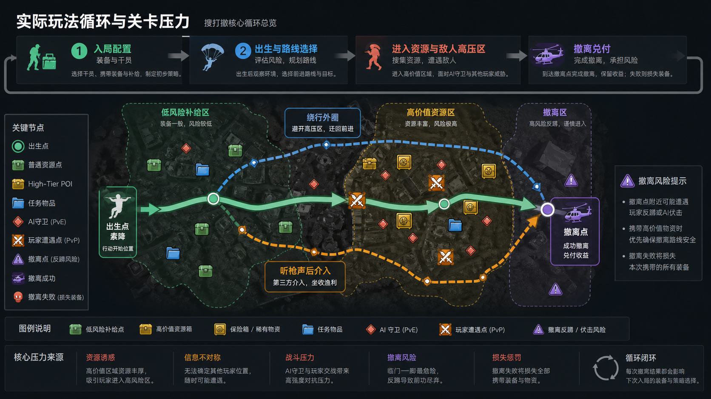

*Illustration: An explanatory analysis diagram generated by image2 to explain the gameplay cycle of "bringing equipment into the game, searching within the game, realizing resources, withdrawing and redeeming, and losing due to failure". It is not an official map scale, nor is it a death heat map. *

This is why the No. 0 Dam, Longbow Valley, and Space Base can coexist in the same search, attack and extraction system. They are not simply "big, medium and small maps", but three different cost models:

| map | main cost | Typical player decisions |
|---|---|---|
| Dam No. 0 | Center resource suction, short rotation, building goal line, evacuation secondary encounter | Start the outer circle first, listen to the gunshots in the center, and then decide whether to grab the administrative core or retreat around |
| longbow valley | Height difference, long-distance sight lines, exposure across rivers, inter-regional transfer costs | Get position first, then get resources; don’t cross the bridge without vision |
| space base | High tier core, indoor black box, strong PvE, goal line and vertical gun | Before entering the core, confirm the team status, otherwise resources will become a consumption trap. |

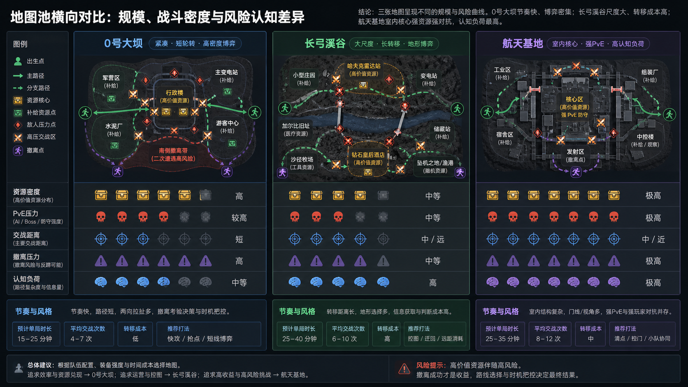

*Caption: The map pool positioning map generated by image2 uses the same set of visual language to compare the resource density, PvE pressure, engagement distance, evacuation pressure and cognitive load of three representative maps. The small map in the picture is a teaching abstract and does not represent the official precise proportions. *

The most valuable thing for a self-research project is not to copy a certain POI, but to learn the structure: resources are not the rewards themselves, but the gravitational force that pulls players into the risk space; evacuation is not a settlement button, but a pressure device that re-liquidates the choices made in the first half of the game.

## 2. Dam No. 0: Focus on dismantling

Dam No. 0 is suitable as a key sample because its design goal is very clear: using a relatively compact map to allow players to quickly understand the basic cycle of "initiating the outer circle, fighting for the center, and evacuating with goods". It does not test cross-terrain vision like Longbow Valley, nor does it force players into a complex indoor black box like the space base. Dam No. 0 is more like the teaching skeleton of the search, attack and withdrawal level: you can repeatedly see resource suction, goal line risk, detour value and evacuation secondary encounters in a round.

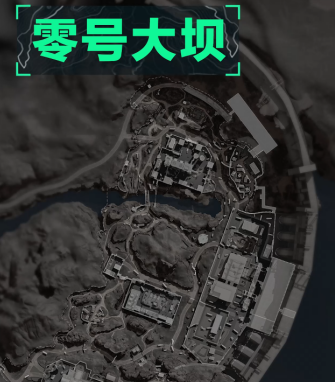

*Caption: The No. 0 Dam area cropped from the real Longbow Creek Valley base map. The direction sign in the lower right corner has been removed from the final material, and what remains is the relative structure of the dam, core building complex, outer road and southern evacuation pressure zone. *

The most noteworthy thing about this picture is not “where are the buildings”, but how the four types of spaces fit together:

| Partition | Picture position | Level function | player behavior |
|---|---|---|---|
| Dam body and waterside road on the north side | The upper half and the water edge on the right | Long-term observation, rapid lateral transfer, exposed zone counterattacked by high points | Fast teams use it to grab the tempo, conservative teams usually don't stick around for long |
| central building complex | Dense buildings in the middle and upper parts | Primary resource draw and early engagement core | The team with high equipment competes for the goal line, and the team with low equipment decides whether to go around after listening to the gunshots. |
| Central mountains and depressions | The undulating area left of center | Split line of sight, interrupt straight-line pursuit, and create a third-party approach window | The remaining soldiers can escape from the battle by taking advantage of the height difference, and the pursuing party needs to pay the cost of detouring. |
| Buildings and roads on the south side | Lower half of buildings, roads and outer edge areas | Secondary resources, preparation before evacuation, secondary encounter area | Players will become cautious again here after getting the central income |
| outer road | Left, down and right circular passages | Low-risk activation, maneuvering around, and avoiding combat before evacuation | Novices and lone wolves often advance along the outer circle, while experienced players will use the outer circle to cut into the center side door. |

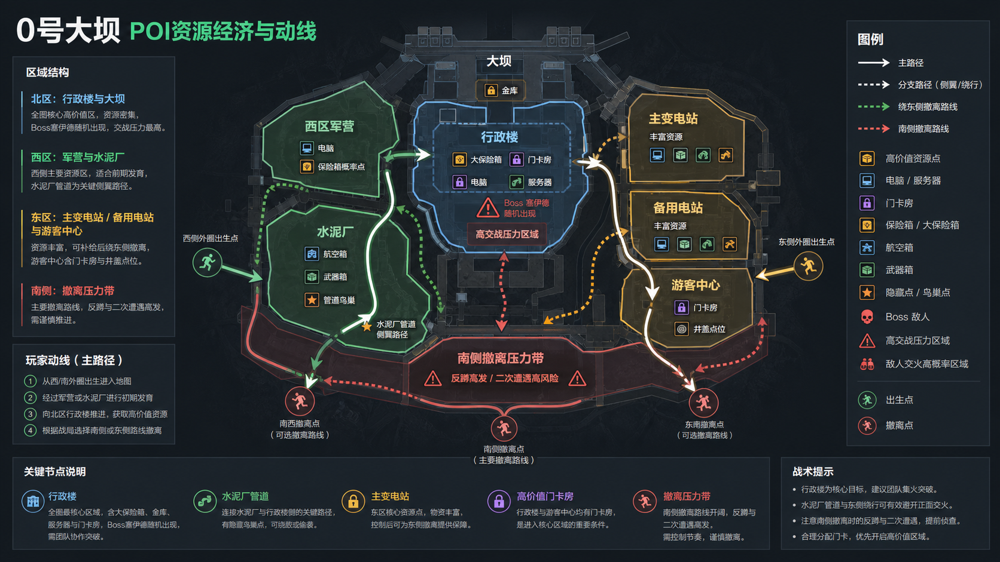

*Caption: The white box illustration of No. 0 Dam generated by image2. In the figure, the military barracks, cement factory, administrative building, dam treasury, main substation, visitor center and south evacuation pressure zone are placed in the same resource-moving line diagram to explain the checkpoint economic relationship behind the real POI data. *

If this picture is regarded as a level design topic, the first rule of Dam No. 0 is: there must be suction in the center, but the outer circle must be viable. If only the center is profitable, the map will turn into a face-off at the beginning; only the outer circle is safe, and the map will turn into picking up garbage around the edges. The structure of Dam 0 puts these two extremes in the same game: the central building is responsible for generating profits and gunfire, and the outer roads are responsible for giving players a second choice.

### 2.1 Overall spatial structure: center suction plus outer ring buffering

Dam No. 0 can be dismantled into a "three-layer ring". The "three layers" here do not mean that three boundaries can be accurately drawn on the map, but three stages of pressure on the level function: the first stage is responsible for pulling the player into the center, the second stage is responsible for allowing the player to judge whether to increase the amount outside the center, and the third stage is responsible for allowing the player to repay the cost when withdrawing with the benefits.

The first level is the central resource ring. It consists of multiple buildings, courtyards, door lines and short-distance passages. It is suitable for placing high-value containers, task triggers, safes, locked rooms or interaction points that require a short stay. Resources cannot be placed just near the entrance of the lobby, otherwise players will run away if they touch them; a better approach is to push high-value points into the second floor of the building, inner rooms, side rooms or deep in the courtyard, so that players can complete the route commitment at least once after entering.

The second layer is the tactical buffer ring. It includes the central mountain, small buildings on the outside, factory edges and road corners. It should not be richer than the core, but it must have supply significance: ammunition, medical, ordinary containers, small mission items, and sellable sundries. Its function is not to make players rich, but to allow players with different equipment levels to "do what they can do at the beginning." Novices establish sound judgment here; lone wolves decide whether to avoid the core here; medium-sized teams wait here for the center to finish a round before going in to finish.

The third level is the evacuation pressure ring. It's located on the outer edge of the map and near the road on the south side. Players should not be safe immediately after leaving the center with their earnings. A good evacuation pressure ring will allow players to change from "offensive state" to "preservation state": shoot less, walk less in open areas, listen to footsteps first, and look at high points first. The resource density here should be lower than in the core, but the bunkers and routes must be complex enough, otherwise the evacuation will only involve running in a straight line.

| ring layer | Content should be placed | Content should not be placed | Design reasons |
|---|---|---|---|
| central resource loop | High value rooms, mission objectives, AI squads, audible combat triggers | Totally risk-free free box | Let the center become the economic engine within the bureau |
| Tactical buffer ring | General supplies, supplies, flank entrances, listening points | High-value resources with the same revenue as the center | Give players preparation and observation windows without taking away central meaning |
| Evacuate the pressure ring | Bunkers, anti-crouching routes, secondary encounter points, low-value supplies | Single unobstructed evacuation runway | Allowing returns to be cashed out still requires judgment rather than automatic settlement |

### 2.2 Architecture and indoor movement lines: Why No. 0 Dam is suitable for teaching "door lines"

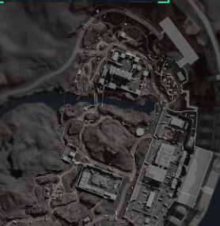

*Note: Cutout of the core building complex of No. 0 Dam. It can be seen that the central high-value area is not an isolated large house, but is composed of multiple buildings, courtyards, roads and waterside boundaries. *

The design of the core building complex focuses on "changing information states multiple times within a short distance." When a player enters the building from outside, the information status will undergo several changes:

1. The outline of the building can be seen outside, but the number of people inside is unknown.
2. Once you reach the door you can hear footsteps or AI gunshots, but you can't see the full room.
3. Entering the first floor gives you control of a room, but is exposed to stairs, windows and side doors.
4. After going up to the second floor, the view becomes better, but the retreat path becomes narrower.
5. After getting the resources, you must go in the opposite direction and cross the exposed goal line or find a side path to leave.

This set of changes is the search and removal of the value of indoor space. Buildings are not decorations, but allow players to constantly trade between "clearer information" and "fewer escape routes".

| indoor node | Suitable functions | Design attention |
|---|---|---|
| Main entrance hall | Let the attacker be exposed for the first time, and the defender will gain the advantage of hearing and setting up guns. | You can't give it just one entrance, otherwise it will become a pure Carmen |
| Side or back door | It gives the attacker the possibility to retreat and also gives the defender an outlet to retreat. | The side door should not face high-value boxes, otherwise it will become a route for box theft. |
| stairs | Vertical information breakpoints, creating grenades, shock, and listening value | A blind area is required above the stairs, but the blind area cannot cover the entire staircase |
| Second floor window | Observe the outer circle and evacuation direction | The window should have a counter-attack angle. Players downstairs can use smoke, thunder, or sideways to force them back. |
| Inner room resource point | Real high value suction power | Don't put it at the first sight when entering the door. It is best to open the door at the corner or twice. |

If you want to reuse the construction logic of No. 0 Dam into a self-developed map, you can build it according to this plan:

| design layer | Recommended practices | Player experience |
|---|---|---|
| outer door | The front door is readable and the side door is semi-hidden. | Players know that there is a direct conflict, and they also know that they can find a second option |
| first floor | Short room, many corners, audible sound | Clearing buildings in close combat is valuable, but it cannot be done without thinking. |
| second floor | Give long sight lines to windows and small amounts | There is room for reconnaissance, setting up guns and throwing objects. |
| inner room | Place high-value resources or task objects | Resources force players to go deeper instead of retreating at the door |
| Exit exit | At least two, one fast but exposed, one slow but covered | After getting the resources, you still have to make route decisions |

### 2.3 Opening design: more doors, windows, and holes are not always better

In a compact map like Dam No. 0, the opening design is more critical than the number of buildings. How many doors a room has, where the windows face, and whether the windows can see the evacuation route will all change the way the entire POI is played.

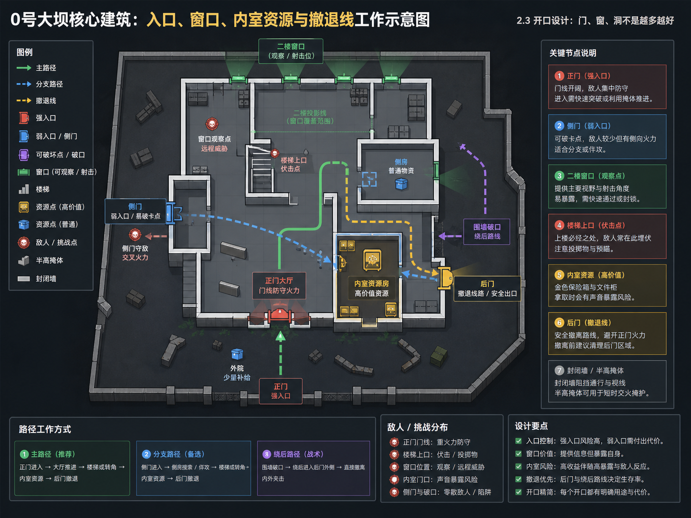

*Illustration: The illustrative floor plan generated by image2 is used to break down the responsibilities of "strong entrance at the front door, weak entrance at the side door, window observation, blind area of ​​the stairs, interior resources, and retreat by the back door". It is not a replica of the actual room, but an extraction of the reusable gate line logic of the core building of No. 0 Dam. *

This type of diagram is suitable for use in the white box stage. Don’t worry about what the room will look like in the end, but ask five questions first: whether the front door is readable, whether the side door can break the stuck point, whether the window gives information but does not control the whole picture, whether the closed wall requires time to go around, and whether the resources are placed in a position of "you have to commit again after entering the door". As long as these five questions are established, the building will not easily degenerate into a single door blocking the gun.

The value of the main entrance is "readable". When players approach the core from the outer circle, they must know at a glance where the main entrance is. The front door is not only the entrance, but also the focus of sounds and thrown objects. It gives the defender an advantage, but the defender cannot permanently lock down the entire building with just one front door.

The value of the side door is the "breaking point". If a high-value room only has a front entrance, the defender can turn the room into a low-cost harvesting point by simply setting up the goal line. After adding the side door, the defender still has the first advantage, but must distribute their attention. The attacker no longer has only one option: to attack the goal. They can bypass, smoke, thunder, false steps, or double attack.

The value of the window is not to allow players to shoot from afar, but to establish information exchange inside and outside the building. The second floor window allows you to observe the route in the outer circle, and players in the outer circle can also use the window to determine whether there is anyone in the building. Window design must control two boundaries: too few windows and the building becomes an information black box; too many windows and indoor players lose all sense of security and the building is no longer worth entering.

Cracks or low wall gaps are suitable for courtyards and exterior walls, but are not suitable for randomly placed in high-value interior rooms. Breaches in the courtyard provide a detour and retreat route. Too many breaches in the inner room will turn high-value resource points into undefendable drafts.

| Opening type | Should be placed | Should not be placed | Purpose |
|---|---|---|---|
| main entrance | Facing a main road or courtyard | Directly post high-value resources | Establish readable entrances and first lines of engagement |
| side door | Building wings, outer paths, and behind courtyard walls | Direct access to the highest value box | Allow the attacker to retreat and allow the defender to retreat. |
| Second floor window | Partial sightlines facing roads, courtyards, and evacuation directions | Covers all entry and exit points simultaneously | Create observation value, but do not allow a single point of full control |
| Wall breach | Courtyards, walls, edges of ruins | High value interior surrounds | Increase route flexibility without damaging the defensive structure of resource rooms |
| half height occlusion | Outside the door, under the window, in the center of the courtyard | middle of narrow staircase | Give a short pause and reload without creating a permanent turtle point |

A good rule of thumb is: every high-value room must have at least one strong entrance and one weak entrance. A strong entrance gives the defender an advantage, and a weak entrance gives the attacker hope. If both entrances are strong, the defender is meaningless; if both entrances are weak, the attacker will only be forced to hit the door.

### 2.4 Closure and obstruction: only when you can see it but cannot walk through it will you choose a route

The outer roads, waterside, mountains and walls of No. 0 Dam jointly bear the sealing function. The closure is not to reduce routes, but to make routes have prices.

"You can see it but you can't walk through it" is the most effective level language. Players see the buildings on the opposite side, hear gunshots, and know there are resources there, but they are separated by bodies of water, slopes, walls, or impassable borders. He can choose to go around, but this will take time; he can also choose to give up and turn to the outer circle resources. This option is more useful than simply using an air wall because it allows the player to understand that they are making a cost judgment.

There are three types of places suitable for closure in No. 0 Dam:

| closed object | Blocking that should be used | design purpose |
|---|---|---|
| Water edge and dam edge | Shoreline, guardrail, drop, non-climbable wall | Prevent players from using a straight line near water to bypass all engagement costs |
| Core building exterior wall | Walls, vehicles, ruins, low walls | Direct players to a few readable entrances instead of randomly entering the building from all directions. |
| Long outer road | Vehicles, engineering equipment, broken walls, slope shielding | Interrupt the sniper line and give the transferred player a short pause. |

Closing does not mean blocking. Blocking will turn the map into a maze, and players will just feel like "I have no choice" after death. Better containment is to let the player know there is another way, but that other way involves running a little longer, going through an open space, or detouring to another sound exposure point.

Reusable design solution:

| Target | Specific practices |
|---|---|
| Limit excessive straight lines | Break the straight line with a wall or terrain, but give a detour 10-20 seconds away |
| Give lone wolves space to escape | Put a series of small bunkers in the outer circle without giving a completely safe corridor |
| Avoid high points, lock in one glance and evacuate | Add a blocking section in the middle of the evacuation road so that only a section of the high point can be seen, rather than the entire process. |
| Prevent resource rooms from being stolen without thinking | Add a corner or door line before the entrance to the inner room so that players can be exposed once before touching resources. |

### 2.5 Line of sight and combat distance: different weapons must be accommodated in the same map

Dam 0 is not a pure CQB, nor is it a pure long range map. Its advantage is that the combat distance is divided into several segments, so that different weapons and operator responsibilities have space value.

| space type | typical location | Engagement Characteristics | favorable configuration |
|---|---|---|---|
| interior door line | Central building, corridors, stairwells | Close range, quick response, incomplete information | Submachine guns, shotguns, short-barreled assault rifles, and Veyron-like corner-clearing capabilities |
| Courtyard and road | Between buildings, outer roads, southern paths | Switching to fire at mid-range requires cover switching. | M4A1/AR-57 type medium and close assault configuration, red wolf type breakthrough capability |
| Dam body and waterside | right and north edges | Strong linear field of view, exposed during transfer | High magnification rifle, reconnaissance information, smoke countermeasures |
| Mountains and slopes | Central high-low difference area | The field of view is discontinuous, suitable for breaking out of combat and approaching third parties. | Reconnaissance, medical recovery, bypass team |

Part of the line of sight should be deliberately retained, and part of the line of sight should be deliberately blocked. The purpose of retaining line of sight is to allow players to read the game before entering: where the gunshots were fired, where there were people, and where there might be body bags. The purpose of blocking the line of sight is to make the player have to move before they can get the next piece of information. The central mountain of Dam No. 0 plays this role: it blocks the complete line of sight between the core and the south side, making the evacuation route unclear.

For self-developed maps, the most common mistake is to allow a high point to see the entrance, resource room, evacuation road, and detour at the same time. Such high points are not tactical points, but map taxes. The high points should be strong, but each high point can only be strong in a certain section: if you can see the road, don't look at the evacuation instructions at the same time; if you can see the courtyard, don't look at all the side doors at the same time.

### 2.6 Resource investment: Let players choose between "taking money" and "exposing"

The resource layer of No. 0 Dam should be divided into three tiers according to risk, rather than evenly distributed according to buildings.

| Resource level | Recommended location | risk design | player behavior |
|---|---|---|---|
| high value resources | On the second floor of the central building, in the inner chamber, deep in the administrative core | Need to enter the door, turn a corner, go upstairs or unlock, and be exposed by the sound when taking it | The high-equipment team grabs the points, while the medium-equipment team waits for the gunfire to finish the game. |
| secondary resources | Buildings on the south side, outer factory buildings, tourist/service buildings | There is a container, but the sight is complicated, and the income is not enough to support long-term stationing. | Newbie startup, remnant supply, lone wolf avoiding battle |
| low risk supplies | Birth side closer, small room, roadside container | Limited income, easy to replenish status | This allows players to start without having nothing to do due to poor equipment. |

High-value resources cannot be defined only by "high value", they must be bound to location. Resources are placed in the core room, and value comes from three parts:

1. The materials themselves can increase outsider returns.
2. Players will make sounds or pause when taking resources.
3. After getting the resources, there is still a stressful road that needs to be crossed before leaving the extraction point.

If the resource point is too close to the extraction point, players will form the habit of "settling as soon as they touch the box"; if the resource point is too far from the extraction point, players will feel that the income does not match the map running time. Dam No. 0 is suitable for a medium redemption distance in short maps: after players get the center income, they can evacuate within half the game, but they must re-pass through the outer circle, the south side or the road pressure zone.

### 2.7 Evacuation point: Evacuation is not a safe house, but the last exam

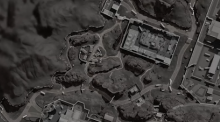

*Caption: Cutout of the area on the south side of Dam No. 0. The value here is not in resource density, but in "after bringing goods from the core, players will reorganize and evacuate through here." *

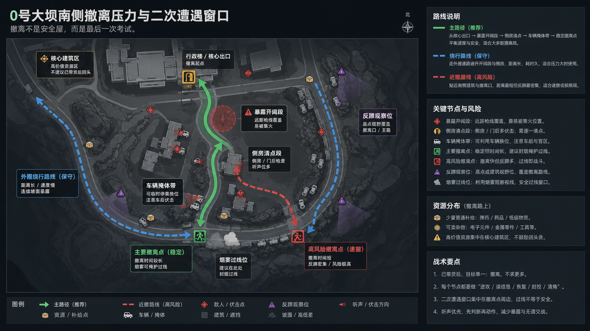

*Illustration: The evacuation pressure map generated by image2 is used to explain how the main road, conservative detour, side room inventory, anti-squatting observation position and smoke crossing position together constitute a "plannable but not free" evacuation after core shipments. *

There are two extremes to fear near the evacuation point: one is completely unobstructed, and players can only be harvested by a single point in the distance; the other is that the bunkers are too dense, and the evacuating party can read the message without risk. Dam No. 0 is more suitable for a "planned but not free" evacuation.

| evacuation design | good practice | bad practice |
|---|---|---|
| Stable evacuation | Further away from the core, the route is longer, but there are obstructions and turns in the middle | Allow players to evacuate without pressure within 10 seconds after coming out of the core |
| high risk evacuation | Being close to the core saves time, but can be heard or observed from multiple directions. | Completely locked by only one high point |
| Anti-squat design | There are two to three approaching directions near the extraction point, and those who are squatting must be distracted. | Those who stay at the site can see the evacuation point, the route of origin and the reading position at the same time. |
| Opportunities for remnants | Create a short escape window for smoke, slopes, vehicles or corners | A straight line in the open space forces players to fight purely with guns. |

Evacuation routes need to have "pressure points," but pressure points can't just be gun lines. Better pressure points include having to cross a section of road with loud noises, having to pass a side room where someone might be hiding, and having to choose between an open field or a long detour. In this way, when the player successfully evacuates, he will feel that he made the right choice instead of the system letting him go.

### 2.8 Deduction of player behavior at Dam No. 0

Dam No. 0 is most suitable for training player life cycles because it allows multiple players to be established on the same map.

| player type | possible route | the space they use | the space they are afraid of |
|---|---|---|---|
| novice player | Start the outer circle, pick up ordinary resources, and retreat after hearing the gunfire in the center. | Buildings on the south side, outer roads, low-risk containers | Second floor of central building, door line, gunfire from unclear source |
| old player | Directly attack the core or grab the side door, get information first and then get resources | Core side door, second floor window, courtyard corner | Withdrawn by a third-party card from the outer circle |
| lone wolf | Don’t force your way into the core, rely on listening, going around, and picking up the pieces. | Mountain obstruction, outer path, secondary entry route | Main entrance door line, double cross gun line |
| three-person team | One person listens outside the frame, one person clears the door, and one person makes up for the status or looks at the flanks. | The building has multiple entrances, courtyards and stairs | Crossing the narrow single entrance and crossing the open exit road |
| conservative team | Add resources and tasks to the outer circle to avoid direct crossfire in the center | Secondary resource areas, stable evacuation routes | Must pass through open areas and long-term high points |
| radical team | Grab the core at the beginning and quickly switch to the side after the fight. | Main entrance, side entrance, second floor window | The third party from the central mountain and the evacuation point counter-crouched |

Reviewing after a player dies is also important. The death of Dam No. 0 should be as understandable as possible for players: "I entered from the main entrance and was held up by the top of the stairs" "I took the resources and walked to the south side, but people on the evacuation route heard footsteps" "I circled too slowly from the outer circle, and the center team had already occupied the second floor window." If players frequently die at points where they can't see, hear, or choose, then the pressure to open, sight, or retreat is excessive.

### 2.9 The spatial interface between Dam No. 0 and operators, props and weapons

Dam No. 0 cannot be viewed as just a “shooting map.” What’s really useful about it is that it connects operator abilities, throwing objects, and weapon distances to specific spaces: whoever can grab doors, read messages, save people, seal narrow openings, and clear dead corners can all be found on the map.

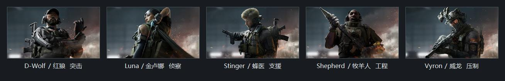

*Caption: A splicing of real information pictures of 5 representative operators. The operators are not listed here as "professional tags", but rather based on what spatial interface their abilities require from the map. *

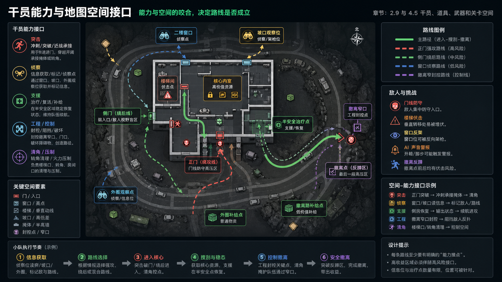

*Caption: The operator-space interface diagram generated by image2 places assault, reconnaissance, support, engineering/control and corner clearance capabilities on specific spaces such as door lines, windows, slopes, semi-safe recovery points, and evacuation narrow openings. The role positions in the picture are descriptions of responsibilities, not a ranking of role strength. *

| Operator/Responsibilities | Map structure acquired by skills | The specific landing point in Dam No. 0 | What to avoid in design |
|---|---|---|---|
| red wolf attack | Short sprint section, hard bunker at the door, turning point in the courtyard | From the outer road to the main entrance of the central building, use vehicles, corners, and low walls to stop before entering. | If there is a long open space outside the main gate, the assault will become a defeat; if there is no secondary bunker behind the gate, the assault will not be able to stand successfully. |
| Veyron clear horn | Corners, stairs, narrow rooms, cheek spots behind doors | In the side room on the first floor of the central building, at the top of the stairs, behind the small gate of the courtyard | A space in the room will make the corner-clearing ability aimless; leaving only one dead door in the room will make the attackers have no choice but to gamble. |
| Golden Luna Class Scouting | Differences in height, windows, slopes, buildings that cannot be read at a glance | Observe the core of the central mountain, check the outer circle from the second floor window, and confirm whether there is anyone on the south side before evacuating. | If all routes are seen at a glance, reconnaissance is worthless; if it is all black boxes, reconnaissance can only become a matter of luck. |
| Bee doctor support | Semi-safe side rooms, behind slopes, behind vehicles, and preparation points before evacuation | Buildings on the south side, behind the core exterior wall, at the corner of the outer road | The treatment point cannot be completely safe, otherwise the team will have unlimited battery life; it cannot be seen by four gun lines at the same time, otherwise the support profession will have no operating window. |
| Shepherd Human Engineering/Counter Reconnaissance | Near stairs, door lines, bridgeheads, narrow roads, and evacuation countdowns | The narrow entrance that must pass through at the core stairwell, courtyard entrance, and evacuation road on the south side | If the control point is not detoured or counterattacked by throwing objects, it will become unsolvable; the control point is too wide and there is no sense of professional presence. |

The same logic applies to props. Smoke is not just about "blocking sight", it requires a gun line that must be crossed; reconnaissance arrows are not just about "illuminating people", they require building layers that cannot be read at once with the naked eye; shock, grenades, and grenades are not just about "causing damage", they require locations behind doors, on top of stairs, and in resource rooms where players will stay briefly.

Weapons also cannot be discussed apart from the map. Mid-range and short-range assault rifles require 20-60 meters of fire space, close combat configurations require door lines and short corridors, and high-power scopes require limited long lines. If Dam No. 0 is all indoors, the long-range configuration will be meaningless; if the long-term outer circle is too strong, the core resources will become whoever launches the gun first will win. A good approach is to cut the weapon advantages into sections: the outer circle is for rifles and high-power scopes to read information, the courtyard is for assault rifles to change shelters, and the inside of the building is handed over to the floor-clearing equipment and props.

## 3. Overall design ideas for other levels

Other maps don't need to be broken down to every door at the granularity of Dam 0, but they can illustrate how the same set of search, attack and extraction mechanisms can be amplified by different terrains.

### 3.1 Longbow Valley: Use height differences and cross-region movement to create pressure

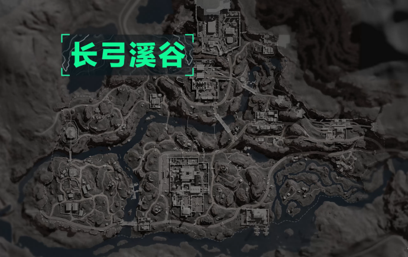

*Note: This is a cropped version of the real base map of Longbow Valley. Only the main area of ​​the valley is retained. Dam No. 0 on the right has been cut off from the main image. *

The difference between Longbow Valley and No. 0 Dam is that Longbow Valley does not teach players by short-distance goal lines, but by terrain and line of sight. Its core experience is "where you want to go is often visible, but you used to have to walk through exposed sections." River valleys, bridges, highlands and slopes divide movement into multiple stages: first occupy the observation point, then decide whether to cross the river or go around the slope, and then enter the resource area.

| Dimensions | longbow valley | Differences from No. 0 Dam |
|---|---|---|
| Level positioning | Intermediate rotation chart, training vision, river crossing, cross-region decision-making | No. 0 Dam Training Center Suction and Short Line Engagement |
| core experience | Position rights precede resource rights | Dam No. 0 often listens to the gunshots from the center before deciding whether to enter. |
| Main lines of movement | Highland observation, river valley transfer, bridge crossing, side slope detour | Dam No. 0 is more of a short rotation from the outer ring to the core. |
| Typical resource area | Radar stations, hotels, villages and towns, and buildings along the line | The distance between resource points is larger and the transfer cost is higher |
| Typical combat zone | Bridgeheads, slopes, highland buildings, river valley edges | Observation time before engagement is longer |
| Evacuation stress | Easily exposed when crossing bridges, going downhill, or crossing river valleys | Dam 0 evacuation comes more from short secondary encounters |

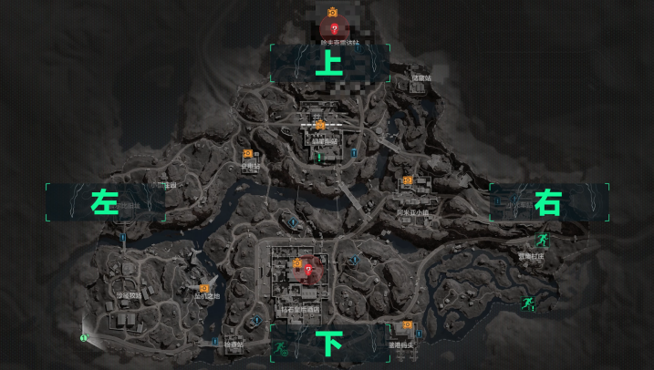

*Caption: Longbow Valley material layer. High-value areas and common material points are not spread out evenly, but form suction along highlands, building groups and traffic nodes. *

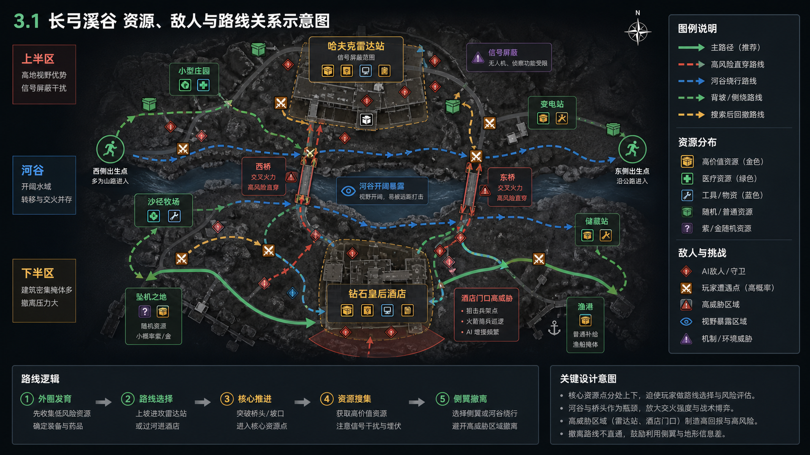

*Illustration note: The illustration of the Longbow Valley generated by image2 puts the Havker Radar Station, Diamond Queen Hotel, river valley, bridge head, slope, signal shielding, sniper/bazooka soldiers and evacuation route into the same route map. The route in the figure is a teaching abstraction under the constraints of data. *

The resource investment in Longbow Valley is suitable for binding to highlands. High-altitude POIs such as radar stations are not only resource points, but also visual assets. Players go there not just to touch boxes, but to gain the right to judge the next route. In this way, resource points have double benefits: material benefits and location benefits.

Specific design examples: If the radar station only has high-value resources, it will become a spot grabbing room; if it only has a field of view and no resources, it will become a passing observation point. Put resources, AI, slopes and long-range sight lines together, and it will become a real point of contention. The attacker is exposed when going uphill, the defender takes the high ground but is afraid of the flanks, and the retreating team has to face the sight of the river valley again when going downhill. The point of this POI is not how complex the interior of the building is, but that it puts "getting resources" in front of "solve the height problem first."

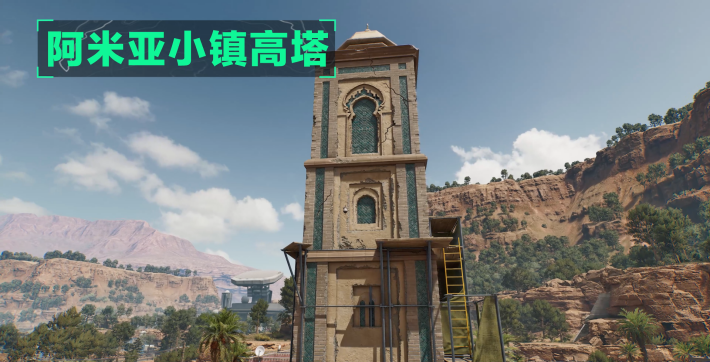

*Caption: Longbow Valley highland scene. The value of high points comes from observation and suppression, but it also exposes the position of the point holder. *

One thing to avoid with this type of highland design is that the high point cannot control all access, resources, and evacuation at the same time. If the radar station can see the bridge, slope, resource room and evacuation route from one window, then the players below will have no tactical choice. A better structure is to allow the high points to be pressed for a period, but not completely: if you can see the bridge head, you cannot see the back slope; if you can see the main road, leave a side slope bypass window.

### 3.2 Space Base: Use core black box and strong PvE to amplify the final risk

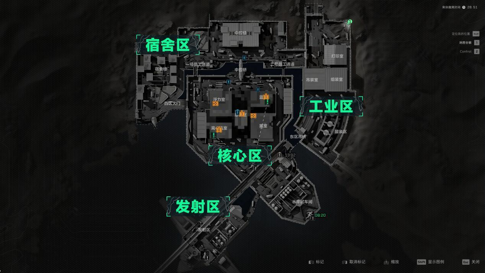

*Note: Map of the real area of ​​the space base. Zones such as the core area, dormitories, industrial areas, and launch areas form a high-tier structure from outer wing launch to center contention. *

The difference between the Space Base and Dam 0 is that it is not a tutorial map, but a high-tier consumption map. When players enter a space base, they usually already accept the higher risk of equipment. The map design will also be more radical: core resources will be more concentrated, PvE will be stronger, indoor information will be darker, and evacuation will rely more on team coordination.

| Dimensions | space base | Differences from No. 0 Dam |
|---|---|---|
| Level positioning | High Tier Resources and the End Game | No. 0 Dam partial basic circuit training |
| core experience | Pay the status cost before entering the core | Dam No. 0 places more emphasis on the choice of center and outer rings. |
| Main lines of movement | Outer wing activation, core door line, central control bridge, vertical floor | Dam No. 0 has a shorter moving line and a lower level of black box |
| Typical resource area | Core area, general control, centrifuge related areas, outer wing supply points | High-value resources are more concentrated and risks are more complex |
| Typical combat zone | Door lines, stairs, elevators, bridges, core side rooms | The density of close combat is higher than that of No. 0 Dam |
| Evacuation stress | After a high profit, you still have to pass through strong enemies, goal lines and possible signal restrictions. | The evacuation of No. 0 Dam relies more on the judgment of the outer route. |

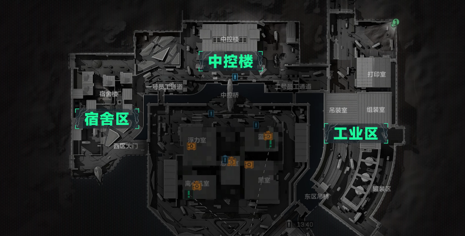

*Illustration: Space base material layer. The resource density in the core area is significantly higher than that in the outer wings, and the outer wings are more like the preparation zone and status arrangement zone before entering the core. *

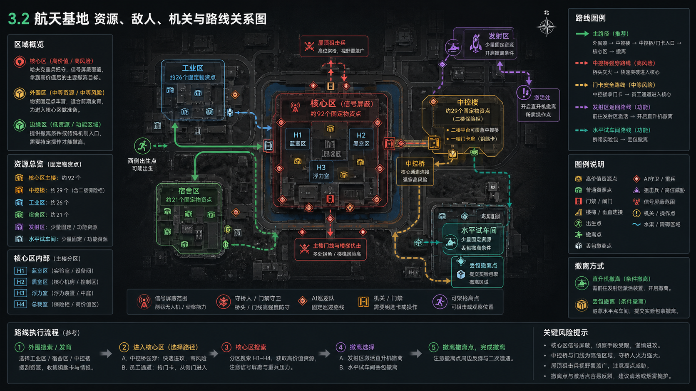

*Illustration: Image2 generates an illustration of the aerospace base that puts the resource/enemy/conditional evacuation relationships of the industrial area, dormitory area, central control building, launch area, horizontal test workshop and core area in the same white box road map. Information such as the number of fixed material points and signal shielding in the core area comes from the data, and the spatial proportions are teaching abstractions. *

The resource allocation of the space base is more like an "economic black hole." High-value content is concentrated in the core, and the outer wings provide initiation and judgment. This structure will naturally screen players: the low-equipment team looks for opportunities on the outer wings, the high-equipment team is sucked into the core, and the remaining formations listen to gunshots on the periphery of the core to decide whether a third party will intervene.

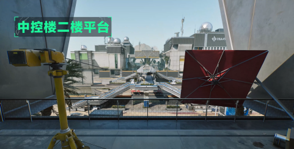

*Caption: Examples of the bridge and central control space in the core area of ​​the space base. Engagement pressure here comes from goal lines, vertical sightlines and forced crossings. *

Specific design example: The core bridge space cannot be regarded as just a "road connecting the two sides". It is responsible for status checks: whether there is smoke in the team, whether there is reconnaissance, whether there is engineering closure, and whether there is medical margin. Without these preparations, crossing the bridge is sending the body into cross-eyes. Compared with Dam No. 0, the space base does not provide players with low-cost solutions that "I can solve in a circle". It requires the team to complete the division of labor before entering the core.

### 3.3 Comparison summary: What are the three images trained on?

| training objectives | Dam No. 0 | longbow valley | space base |
|---|---|---|---|
| resource judgment | High value in the center and guarantee in the outer circle | Binding of highland resources and location rights | Binding core high value with high consumption |
| Movement line judgment | Short rotation, side door, extraction secondary encounter | Crossing rivers, going uphill, going around bridges, observing from a distance | Outer wing to core, door line to floor, entry to exit |
| information judgment | Listen to the gunfire in the center to determine whether to enter the building | Get the field of view first, then decide to cross zones | Relying on reconnaissance and collaboration in the black box space |
| PvE features | Low to medium pressure to help expose locations and states of consumption | Medium pressure, often tied to high points and inlets | High pressure directly becomes the cost of entering the core |
| Suitable for player stage | Novice to intermediate | Intermediate to skilled | High equipment and high synergy team |

Three pictures can form a learning curve: Dam No. 0 teaches players to understand the basic economy of search, strike and retreat; Longbow Valley teaches players to deal with positional rights in a larger space; Space Base allows players to put equipment, operators, props, PvE and evacuation all into the same high-pressure decision-making.

## 4. Summary of level design methods

### 4.1 Use resource points to pull players instead of pushing them hard with tasks

Resource points must have spatial identities. The central building of Dam No. 0 is suitable for placing high-value resources because it is surrounded by gate lines, courtyards, side doors and evacuation pressures. The radar station in Longbow Valley is suitable for placing high-value resources because it also has a high-land view. The core of the space base is suitable for the highest tier because players must pay PvE, goal line and team coordination costs before entering.

Self-study inspection:

| question | If the answer is no, it should be adjusted |
|---|---|
| Will high-value resources force players deeper into space? | Move resources from the entrance to the inner room, second floor, unlocking room, or interaction point that needs to be exposed |
| Can secondary resources be activated by low-level players? | Add ordinary containers, medical treatment, and small mission items to the outer circle, so as not to leave players with nothing to do at the start of the game |
| Do resource points affect route selection? | Bind resources to side roads, slopes, bridges, and goal lines |

### 4.2 Use extraction points to create pressure in the second half of the game

The extraction point is not an exit icon at the edge of the map. It wants to answer: Do players still need to make judgments after receiving the benefits? The evacuation pressure zone on the south side of No. 0 Dam shows that the last stretch before evacuation does not have to be rich, but there must be tactical issues: whether to take the open road, whether to go further, whether to clear the side room first, and whether to use smoke to cross the line.

During self-research, evacuation points can be divided into two categories:

| type | fit for purpose | design requirements |
|---|---|---|
| Stable evacuation | Guarantee for novices, remnants, and task teams | Further and slower, but not completely locked by a single high point |
| high risk evacuation | Save time for high-end equipment teams or pay high profits | Closer and more dangerous, you must have anti-crouching and approach from multiple directions |

### 4.3 Use openings and closures to control route complexity

A complicated route does not mean there are many entrances. The core building of Dam 0 should allow players to have a main entrance, a side entrance, a window, a courtyard, and an exit, but each opening must have a clear responsibility. Meaningless openings will only make the space out of control, and no one will know where to stand.

A search, strike and evacuation building can use this template:

| Location | Minimal configuration | Purpose |
|---|---|---|
| main entrance | 1 strong entrance | Give readable head-to-head combat |
| flank | 1 weak entry | Break the pure stuck point and bypass it. |
| Second floor | 1-2 viewing windows | Create an information advantage but leave a countervailing angle |
| inner room | 1 resource room or task room | Get players deeply committed |
| retreat | 1 is fast but exposed, 1 is slow but obscured | Let the choices made after getting the resources continue to stand |

### 4.4 Use height difference and line of sight to shape weapon differences

If the map only provides one distance, players will end up choosing the most suitable weapon. The value of Dam No. 0 lies in the distance it cuts: the core building is for close combat, the courtyards and roads are for mid-range assault, the dam body and outer ring are for long-term observation, and the central mountain is responsible for interrupting pursuit. Longbow Valley amplifies long-range observation, while the space base presses close-range, vertical and goal lines to the highest density.

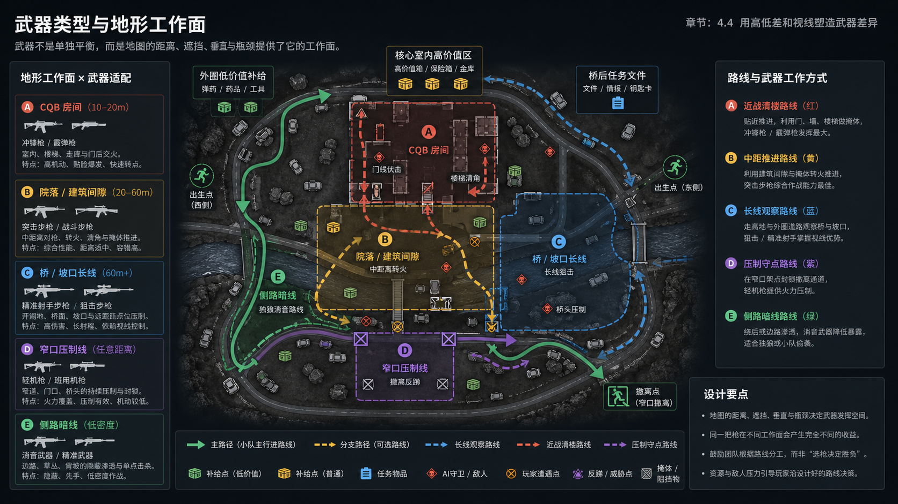

*Illustration: The weapon-terrain working surface map generated by image2 maps the four types of spaces: CQB room, courtyard/building gap, bridge/slope long line, and narrow mouth suppression to melee combat, assault rifle, precision shooter/sniper, light machine gun, and silenced side attack. It's not a weapon strength meter, it's a level white box inspection map. *

This picture can be used directly for white box inspection: if there is no 10-20 meter door line in a map, the melee configuration can only rely on stealth; if there is no 20-60 meter bunker-to-fire section, the assault rifle will be forced to fight at too close or too far distance; if there is no long line but high magnification benefits are released, players will feel that the equipment selection is distorted; if there is no flank countermeasures in the narrow mouth, LMG and engineering blockade will become a map tax.

| Weapons/playstyle | Most desired map conditions | Location in Dam No. 0 | Location in Longbow Canyon | Location in the space base | level countermeasures |
|---|---|---|---|---|---|
| Submachine gun/shotgun melee | 10-20 meters door line, short corridor, staircase entrance | First floor of central building, side room, resource room | Radar station interior, hotel room | Core area door line, room behind bridge, stairwell | Provide side doors, grenade corners, and evacuable rooms to prevent a single door from becoming a pure gun blocker. |
| short barrel assault rifle | 20-60 meters courtyard, road, exterior wall corner | Core outer courtyard, between buildings on the south side, and outer roads | Between buildings in villages and towns, from bridgehead to slope entrance | The connection section from the outer wing to the core entrance, dormitories and industrial area | The bunkers are segmented to avoid taking up the entire route in one straight line. |
| DMR/High Power Rifle | Observation lines, slopes, bridges and roofs above 60 meters | North side dam, waterside road, central mountain observation position | Highlands, river valleys, bridges, radar station outer slopes | Outer wing corridor, edge of launch area | Back slope, smoke, blocked section, detour time difference |
| LMG/suppressive fire | Necessary to pass through narrow entrances, long door lines, and sustainable gun points | Outside the main entrance, the narrow entrance of the evacuation road, and the edge of the courtyard | bridgehead, river crossing, slope entrance | Core bridge, central control passage, stairwell | Let the suppression position expose the flanks and not cover the entrance and retreat at the same time. |
| Silencer/lone wolf configuration | A low-density side lane that can be heard, can be bypassed, and can close the endgame | The outer road, the small building on the south side, and the mountain in the middle | Village edge, valley side slope | Outer wing resource area, core periphery | The side benefits cannot be higher than the core, otherwise the lone wolf route will take away the main conflict. |

Weapons cannot be solved by numerical balance alone. The level must provide "instructions for use" for weapons: close combat is strong because the room is short; high-magnification scope is strong because there is an open section; suppressive fire is strong because it must pass through a narrow opening. On the other hand, if a player brings shotguns but is forced to run 80 meters into an open area, or brings a high-power scope but can only hit stairs throughout the game, it is not that the player chose the wrong gun, but that the map does not leave a working surface for the weapon.

### 4.5 Operator abilities should be connected to the space, not just written on the skill panel

Operator career design and level design must feed each other. Assault operators need a bunker to take over after a short sprint, reconnaissance operators need a layer of information that cannot be read in one go, support operators need a semi-safe recovery window, and engineering/control operators need narrow openings that can be sealed but not unsolvable. If the map does not provide these interfaces, no matter how gorgeous the skills are, they will just become numerical buttons.

The operator map is easiest to make into a "character strength map", but what really matters in level planning is whether the abilities are implemented. The red wolf needs a corner that can stop after sprinting; Jinluna needs windows, slopes and unknown areas after blocking; the bee doctor needs a semi-safe recovery point; the shepherd needs a narrow opening but cannot seal the map; the Veyron needs corners and stairs. As long as the map does not provide these positions, the characters will degenerate from "differences in play style" to "differences in numerical values."

| Operator/Responsibilities | space interface | Dam No. 0 Example | Longbow Valley Sample | Space base example |
|---|---|---|---|---|
| red wolf attack | There must be a hard bunker after the sprint phase, suitable for pressing into the core from the outer circle | From the outer circle road to the central main entrance, vehicles or corners will be stopped. | Seize the bridge head from the slope and seize the high ground from the edge of the village and town. | Short drive from outside wing to core goal line |
| Veyron type suppression/clearing angle | Requires enemies behind doors, short corridors, corners, and who can be forced out by skills | At the top of the stairs, behind the inner door, and at the courtyard door | Radar station indoors, hotel corridor | Core side room, bridge back door line |
| Golden Luna Class Scouting | Requires height differences, windows, bevels, and unknown areas after occlusion | The core is seen from the central mountain, and the outer circle is seen from the second floor window. | Check the bridgehead and river valley on the high ground, and read the enemy before the slope. | Check the door line and vertical position before entering the core |
| Bee doctor support | Semi-safe treatment points are required, not fully safe nor fully exposed | Small buildings on the south side, behind core exterior walls, behind vehicles | Back slopes, behind bridges, exterior walls of villages and towns | Outer wing rooms, core peripheral finishing points |
| Shepherd Human Engineering/Counter Reconnaissance | Requires narrow mouths and contestable lines of control | Staircases, courtyard doors, narrow entrances to evacuation roads | Bridgehead, slope entrance, radar station entrance | Core bridge, elevator/stairs, door line |

To judge whether a map is a good job for the profession, you can look at three questions: first, whether the assault has a point where you can "stand still after charging"; second, whether there is a point on reconnaissance where you can "make a decision after seeing it"; third, whether support and engineering have a point where it is "strong but will be countered". Dam No. 0 is suitable as an introductory map in this regard, because these interfaces are relatively short, and players can quickly match the skill effects with the terrain results.

### 4.6 Use PvE to increase friction instead of using AI as filler

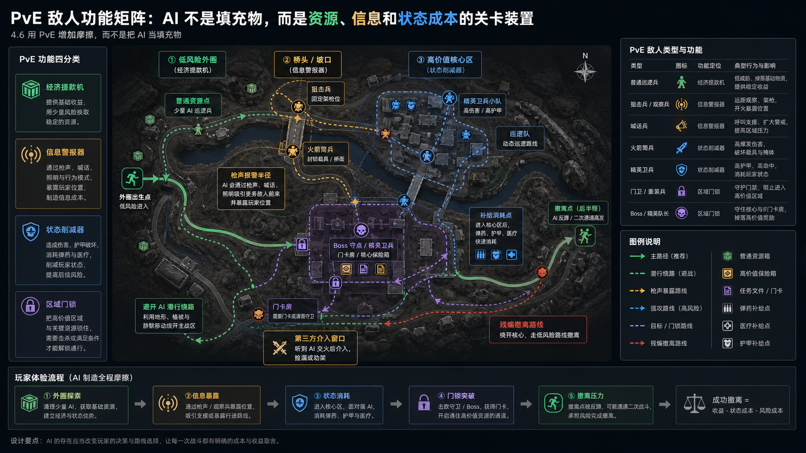

*Note: The PvE function matrix diagram generated by image2 puts the four AI functions of economic cash machines, information alarms, status reducers and regional door locks into the same player route. The exact refresh rate is not expressed in the figure, only the level function. *

PvE has at least four functions in Search and Fight:

| PvE features | Placement | effect |
|---|---|---|
| Economic cash machine | Low risk outer circle | Start income and basic rhythm for low-level players |
| information alarm | 入口、桥、坡口、核心外侧 | Clearing the AI ​​will reveal gunshots and alert other teams |
| status reducer | high value core | Consumes armor, ammunition, medical care and skills, increasing resource costs |
| Area door lock | Boss, elite guard, condition trigger area | Change the High-Tier resource from "Who comes first" to "Who can organize the clearing" |

Dam No. 0 is suitable for teaching players "shooting will expose" with light to moderate PvE; Longbow Valley is suitable for placing the AI ​​at a high point or near the entrance, so that clearing monsters and fighting for vision are bound; the space base can allow strong PvE to directly become an admission tax for core resources.

### 4.7 Let players feel that success or failure comes from judgment.

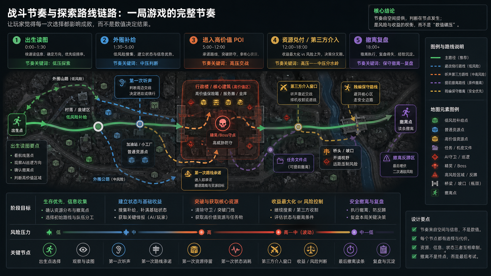

*Illustration note: The battle rhythm diagram generated by image2 strings birth map reading, outer circle supply, entering high-value POI, third-party intervention, and evacuation review into a reusable rhythm chain. It's for level design review, not actual game footage or death distribution. *

The fun part of searching, fighting and retreating is not that you come out alive, but that the player feels "I made several correct judgments". The advantage of Dam No. 0 is that the judgment chain is very short, and it is easy for players to review: why I entered the center, why I took the side door, why I went around the south side when evacuating, and why I was hit by the second-floor window. Longbow Valley and Space Base lengthened the chain of judgment, testing positional rights and team coordination respectively.

Design checklist:

| Check items | Qualification standards |
|---|---|
| Whether resources form multi-level suction | High-value, secondary, and low-risk supplies each have their own location and identity. |
| Does the hotspot have at least 3 entries into the relationship? | Frontal, flanking, secondary entry or height difference routes exist at the same time |
| Is the defense strong but not unsolvable? | The defensive side takes the initiative, and the attacking side counterattacks by throwing objects, side doors, or around the back. |
| Can evacuation be planned but not free? | Players can design routes in advance, but they cannot ignore anti-crouching and exposure sections. |
| Whether the novice route and the high-tier route are established at the same time | The outer ring can be activated, and the center has suction. The two will not take away the value of each other. |
| Can the player be replayed after death? | Cause of death can be mapped to sound, sight, goal line, route selection or equipment status |

## 5. Information and references

This section collects the data boundary, local image assets, and external references in one place. Captions in the main text explain how to read each figure; source links and asset notes live here for readers who want to verify them.

### data boundaries

This article only uses content that can be traced to real maps, real screenshots, real gameplay rules or verifiable information. "Death heat maps", "accurate fatality rates" and "official internal route data" that cannot be stably traced are not used. The judgments in this article about the pressure zone, suction zone, evacuation window and player behavior are design deductions based on the map structure, resource layer, PvE function and search, attack and withdrawal rules.

### Figure Reading Notes And Local Assets

The table below lists the local image files used in the text and what each one supports. The figures help readers understand resources, routes, extraction pressure, and spatial interfaces; precise scale, refresh rates, death distribution, or official values should still be checked against the written analysis and external sources.

| local assets | use | Processing Instructions |
|---|---|---|
| `assets/layali-grove-map.png` | Base map of the relationship between the original Longbow Valley and Dam 0 | Keep it as original material and do not use it directly as text image. |
| `assets/layali-grove-map-no-north.png` | Longbow Canyon No Directional Signs | Re-cut based on the original base map, remove the direction mark below the No. 0 dam, and do not redraw the tactical content. |
| `assets/layali-grove-map-cropped.png` | Cropped view of the main body of Longbow Canyon | Cropped from the original real base map, only the main body of the valley is shown, and the No. 0 dam on the right side is not shown. |
| `assets/zero-dam-from-layali-overview.png` | Overview cutout of No. 0 Dam | Cropped from the non-directional version for Dam 0 overview analysis |
| `assets/zero-dam-core-crop.png` | Cutout of the core building complex of No. 0 Dam | Cut from the non-directional version for use in architectural and interior circulation analysis |
| `assets/zero-dam-south-extract-crop.png` | Cutout of the evacuation pressure zone on the south side of No. 0 Dam | Cropped from non-directional version for use in evacuation stress analysis |
| `assets/layali-grove-resource.png` | Longbow Valley Resource Layer | Used to illustrate the relationship between resources, highlands and inter-regional movement |
| `assets/layali-grove-high-ground.png` | Longbow Valley Highlands Example | Used to illustrate the relationship between high ground sight lines and countermeasures |
| `assets/space-city-map.jpg` | Space base area map | Used to illustrate the zoning relationship from the outer wing to the core |
| `assets/space-city-resource.png` | space base resource layer | Used to illustrate the relationship between core resource density and outer wing startup |
| `assets/space-city-core-bridge.png` | Space base core bridge/central control space example | Used to illustrate goal lines, vertical sightlines and strong crossing pressures |
| `assets/op-dwolf.jpg`、`op-luna.jpg`、`op-stinger.jpg`、`op-shepherd.jpg`、`op-vyron.jpg` | Real information map of representative operators | After downloading to the local computer, it can be used for character-map interface analysis. |
| `assets/operators-contact-sheet.jpg` | Representative operator contact map | The above 5 real operator pictures are spliced ​​together for quick comparison of the text. |
| `assets/level_diagram_01_gameplay_loop.png` | image2 Schematic diagram of gameplay loop | Explain the entry, search, resource redemption and evacuation risks in the beacon zone |
| `assets/level_diagram_02_zero_dam_resource_route.png` | image2 No. 0 Dam Resource Movement Map | Describe the resource economy between the military barracks, cement plant, administrative building, main substation, visitor center, and evacuation pressure zone |
| `assets/level_diagram_03_zero_dam_entry_shortcuts.png` | image2 Dam entrance/shortcut map | Replace the old opening plan, illustrating the main entrance, side doors, windows, stairs, interior resources and retreat lines |
| `assets/level_diagram_04_zero_dam_extraction_pressure.png` | image2 No. 0 Dam evacuation pressure map | Explain the main road, detour, anti-crouching and secondary encounter window after the core is shipped |
| `assets/level_diagram_05_operator_space_interfaces.png` | image2 Operator space interface diagram | Describe the space interfaces required for assault, reconnaissance, support, engineering/control, and clearance capabilities |
| `assets/level_diagram_06_longbow_resource_enemy_routes.png` | image2 Longbow Valley Route Map | Explain the relationship between radar stations, hotels, river valleys, bridgeheads, enemy points and resource routes |
| `assets/level_diagram_07_map_pool_comparison.png` | image2 Map pool comparison chart | Explain the differences in positioning of No. 0 Dam, Longbow Valley, and Space Base |
| `assets/level_diagram_08_space_base_resource_enemy_routes.png` | image2 Space base road map | Explain the relationship between peripheral area, core area, resources, strong PvE, card entrance and conditional evacuation |
| `assets/level_diagram_09_pve_friction_matrix.png` | image2 PvE feature matrix diagram | Explain the functionality of AI in economy, information, state consumption, and area door locks |
| `assets/level_diagram_10_weapon_terrain_fit.png` | image2 Weapon terrain working surface map | Replaced the old weapon map to illustrate the terrain working surface corresponding to different weapon types |
| `assets/level_diagram_11_combat_pacing_route.png` | image2 Battle Rhythm Roadmap | Explain the rhythm chain from birth, exploration, combat, third-party intervention to evacuation review |

### external information

| material | address | Usage |
|---|---|---|
| 3DM mobile game "Delta Operation Dam Zero Map Introduction" | https://shouyou.3dmgame.com/gl/576503.html | Refer to the No. 0 Dam map, point locations and basic POI relationships |
| 3DM online game "Delta Operation Longbow Valley Map Introduction" | https://ol.3dmgame.com/gl/278859.html | Refer to the Longbow Valley bottom map, resource layer, highland and radar station relationship. |
| 3DM online game "Delta Operation Space Base Map Introduction" | https://ol.3dmgame.com/gl/278858.html | Refer to the space relationship between space base area, resource layer and core area. |
| Delta Force Official Map Tool | https://www.playdeltaforce.com/en/maps.html | Review current-version maps, positions, and extraction information; exact positions should follow the official tool and current patch context. |
| Zero Dam - Reshaped official dev note | https://www.playdeltaforce.com/en/detail/news-zero-dam-reshaped-a-dev-note-for-operators-heading-in.html | Evidence that Season Echo changed Zero Dam structure and player routes. |
| Delta Force Maps | https://www.deltaforcemaps.com/ | Serves as a cross-checking source for map locations, evacuation and resource information |
| "Operation Delta" encyclopedia information | https://zh.wikipedia.org/wiki/%E4%B8%89%E8%A7%92%E6%B4%B2%E8%A1%8C%E5%8A%A8 | Reference game modes, operator types and basic gameplay cycle descriptions |
| CharlieIntel《All Delta Force operators and abilities》 | https://www.charlieintel.com/games/delta-force-hawk-ops-operators-335039/ | Cross-check the professional ability descriptions of D-Wolf/Red Wolf, Luna/Golden Luna, Stinger/Bee Doctor, Shepherd/Shepherd, and Vyron/Weilong |
